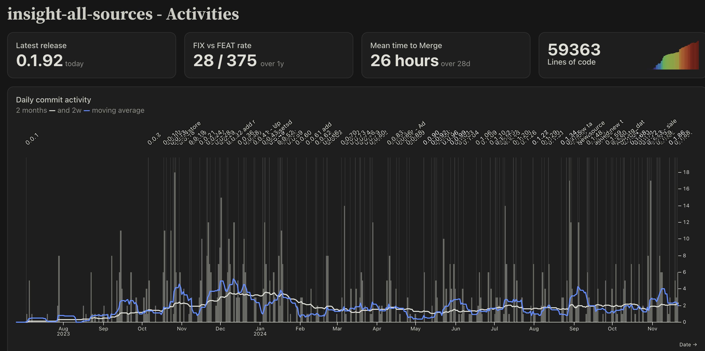

# Github Insights

This project aims to monitore the Github repository of your choice, 
it looks for main activities, like Pull Requests, releases, commits and any kind of contribution.

### Features
- Time between 2 releases
- Fixes vs PR rate
- Mean time to Merge PR
- PlusMinus lines of Code

Target vision is to map metrics from [DORA research](https://dora.dev/research/?view=detail) : 
 - Lead time, 
 - Change failure rate
 - Deploy frequency
 - Recovery time

Inspired by [oss-analytics](https://github.com/observablehq/oss-analytics/tree/main), by the Observable's team

### Used at Decathlon Digital
I use this project [@Decathlon](https://digital.decathlon.net/) to follow our distributed organization of analytics engineering. 
We have internal shared repositories (OSS like)  and a lot of contributions to them each week. It helps me to **control the way** new things are added to the *Common Good*



### dashboard 

[Live demo]()

## Getting Started
### Run in Github action

Just use the `.github/workflow.yml` in your project

Provide the following environment variables : 

```env
GITHUB_TOKEN=<GITHUB Personal Access Token>
GITHUB_ORG=<decathlon_a_fond_la_forme>
GITHUB_REPO=<my_dbt_repo>
GITHUB_BRANCH=<my_branch> # optional
```

Here is the doc for your Github's [Personal Access Token](https://docs.github.com/en/authentication/keeping-your-account-and-data-secure/managing-your-personal-access-tokens)

### Run in Local

#### setup

Tested requirements : NodeJS v22.8.0, Python 3.13.0

```sh
python -m venv venv
source venv/bin/activate
pip install dbt-duckdb==1.9.0
npm install
```

#### Execute


1. create your `.env` (an [example](.env.example) is provided)


2. Run Extraction and prepare data with dbt 

The extraction part is managed by Javascript script in `src/data/*.json.js`
```sh
make download
make transform
```

3. run Webserver

```sh
make dev
```

## Development guide
### Viz

This is an [Observable Framework](https://observablehq.com/framework) app. To start the local preview server, run:
```
npm run dev
```

Then visit <http://localhost:3000> to preview your app.

For more, see <https://observablehq.com/framework/getting-started>.

The project looks like this:

```ini
.
├─ models
│  ├─ mart
│  │  └─ daily_activities.sql  # The main model : it records all counts and measures from pr contributions
│  ├─ staging
│  │  └─ stg_*.sql             # select * from read_json(downloaded_file_path)
├─ src
│  ├─ components
│  │  └─ dailyPlot.js          # an importable module
│  │  └─ sparkbar.js           # an importable module
│  │  └─ linkable.js           # an importable module
│  ├─ data
│  │  ├─ pull_requests.json.js # a data loader for pull requests
│  │  ├─ releases.json.js      # a data loader for github releases
│  │  ├─ contributors.json.js  # a data loader for github releases
│  └─ index.md                 # the home page
├─ .gitignore
├─ profiles.yml                # configure duckdb to read JSON from data loaders, and then write parquet files
├─ dbt_project.yml                # configure duckdb to read JSON from data loaders, and then write parquet files
├─ observablehq.config.js      # the app config file
├─ package.json
└─ README.md
```

**`src`** - This is the “source root” — where your source files live. Pages go here. Each page is a Markdown file. Observable Framework uses [file-based routing](https://observablehq.com/framework/routing), which means that the name of the file controls where the page is served. You can create as many pages as you like. Use folders to organize your pages.

**`src/index.md`** - This is the home page for your app. You can have as many additional pages as you’d like, but you should always have a home page, too.

**`src/data`** - You can put [data loaders](https://observablehq.com/framework/loaders) or static data files anywhere in your source root, but we recommend putting them here.

**`src/components`** - You can put shared [JavaScript modules](https://observablehq.com/framework/javascript/imports) anywhere in your source root, but we recommend putting them here. This helps you pull code out of Markdown files and into JavaScript modules, making it easier to reuse code across pages, write tests and run linters, and even share code with vanilla web applications.

**`observablehq.config.js`** - This is the [app configuration](https://observablehq.com/framework/config) file, such as the pages and sections in the sidebar navigation, and the app’s title.

### Command reference

| Command           | Description                                              |
| ----------------- | -------------------------------------------------------- |
| `npm install`            | Install or reinstall dependencies                        |
| `npm run dev`        | Start local preview server                               |
| `npm run build`      | Build your static site, generating `./dist`              |
| `npm run deploy`     | Deploy your app to Observable                            |
| `npm run clean`      | Clear the local data loader cache                        |
| `npm run observable` | Run commands like `observable help`                      |
